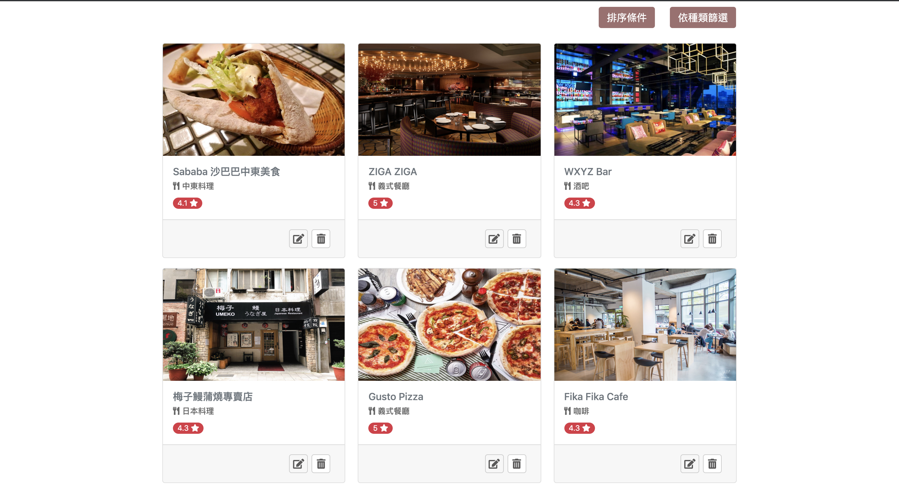

# 我的餐廳清單
整合式的餐廳清單，使用者可操作基礎的CRUD（新增 / 讀取 / 更新 / 刪除）功能

## Features 
- 可新增、讀取、更新、刪除餐廳資料
- 可針對所有餐廳種類進行篩選(Filter)
- 可按照（中文名稱 / 英文名稱 / 評分高低）進行餐廳排序
- 可在每一間餐廳中新增評論至評論區
- 刪除前會提醒使用者是否要刪除以免誤按

## Screenshots
- 首頁: 點擊卡片上半部可進入詳細頁面，點擊下半部左邊按鈕可到達編輯頁面，點擊下半部右邊按鈕可刪除

- 新增: 點下首頁的「點我新增餐廳 Go !」，進到新增頁面
![./public/images/new.png]

- 排序: 滑鼠移至排序條件將出現下拉選單，點選要排序的條件
![./public/images/sort.png]

- 篩選: 滑鼠移至篩選條件將出現下拉選單，點選要篩選的餐廳種類
![./public/images/filter.png]

- 刪除前出現確認刪除對話框
![./public/images/delete-confirm.png]

- 每個餐廳頁面下方可新增留言至評論區，將自動生成時間
![./public/comment.png]