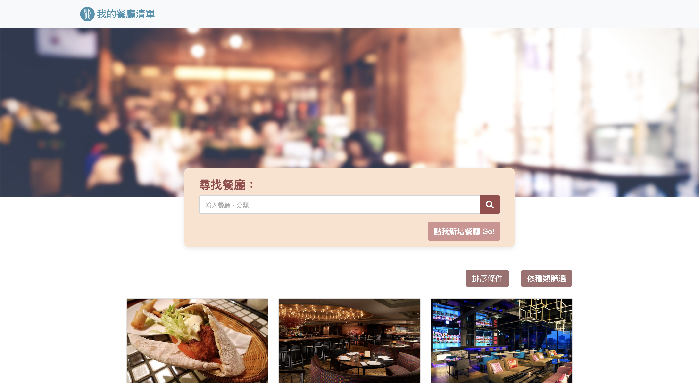
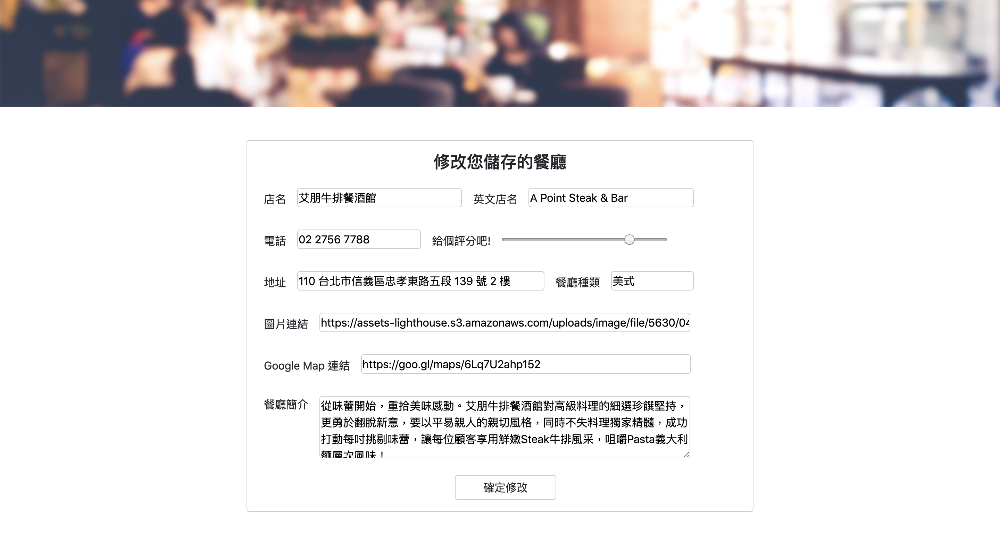
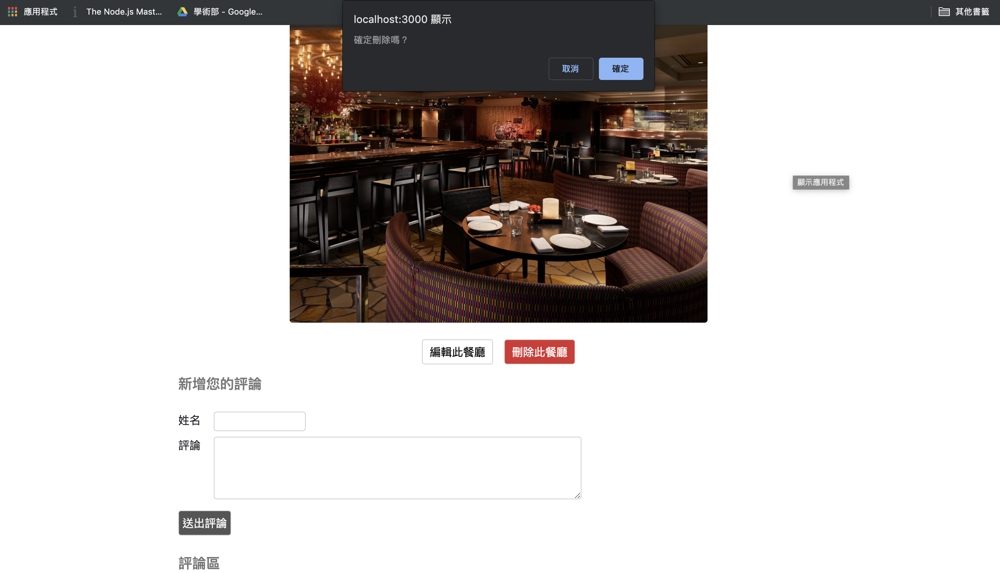
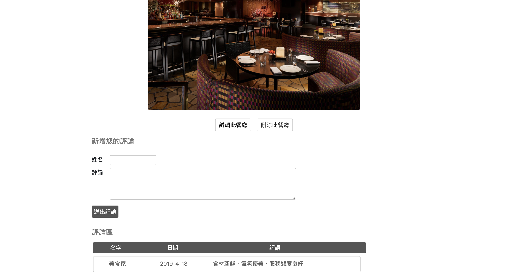

# 我的餐廳清單
整合式的餐廳清單，使用者可操作基礎的CRUD（新增 / 讀取 / 更新 / 刪除）功能

## Features 
- 可新增、讀取、更新、刪除餐廳資料
- 可針對所有餐廳種類進行篩選(Filter)
- 可按照（中文名稱 / 英文名稱 / 評分高低）進行餐廳排序
- 可對餐廳名稱及種類進行搜尋
- 可在每一間餐廳中新增評論至評論區，系統將自動生成評論日期
- 刪除前會提醒使用者是否要刪除以免誤按

## Screenshots
- 首頁: 點擊卡片上半部可進入詳細頁面，點擊下半部左邊按鈕可到達編輯頁面，點擊下半部右邊按鈕可刪除

- 新增: 點下首頁的「點我新增餐廳 Go !」，進到新增頁面

- 編輯頁面

- 篩選與排序: 可點擊要排序的條件及篩讓餐廳種類，可交集搜尋

- 刪除前出現確認刪除對話框

- 每個餐廳頁面下方可新增留言至評論區，系統將自動生成日期
